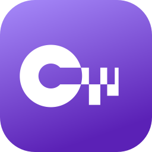
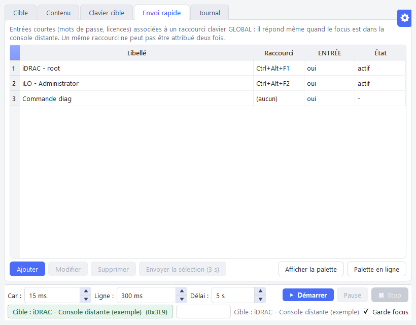

<p align="center">
  
</p>

<h1 align="center">SendToConsole</h1>

<p align="center">
  Tape pour vous du texte et des mots de passe dans les consoles distantes
  où le copier-coller ne passe pas : iDRAC, iLO, XClarity, IPMI/SOL, noVNC, RDP.
</p>

<p align="center">
  <a href="https://github.com/Kenny3231/SendToConsole/actions/workflows/ci.yml"></a>
  <a href="https://github.com/Kenny3231/SendToConsole/releases/latest"></a>
  <a href="LICENSE"></a>
  
</p>

<p align="center">
  <b><a href="https://kenny3231.github.io/SendToConsole/">Documentation</a></b> ·
  <b><a href="https://github.com/Kenny3231/SendToConsole/releases/latest">Télécharger</a></b> ·
  <b><a href="SECURITY.md">Sécurité</a></b>
</p>

---

<p align="center">
  
</p>

## Pourquoi

Les consoles d'administration à distance (KVM IP, consoles HTML5, sessions
RDP restreintes) refusent souvent le presse-papiers. Il faut alors retaper à
la main des mots de passe longs, des clés de licence ou des scripts entiers,
avec en prime les pièges des dispositions clavier (AZERTY/QWERTY, AltGr).

SendToConsole **simule la frappe clavier** vers la fenêtre de votre choix,
caractère par caractère, au niveau des scancodes : la console reçoit
exactement ce qu'aurait tapé un clavier physique.

## Fonctionnalités

- **Envoi de texte** : collez ou chargez un script, choisissez la fenêtre
  cible, lancez l'envoi (compte à rebours, pause, reprise, arrêt).
- **Envoi rapide** : des entrées courtes (mots de passe, licences, commandes)
  associées à un **raccourci clavier global**, utilisable même quand le focus
  est dans la console distante.
- **Coller par frappe** : copiez normalement (Ctrl+C), cliquez dans la
  console, pressez votre raccourci « Coller » : le texte copié y est **tapé**,
  même là où le collage est bloqué. Plusieurs lignes : deux appuis pour
  confirmer ; caractères de contrôle refusés.
- **Palette flottante** : un clic sur une entrée l'envoie, sans jamais voler
  le focus de la console.
- **Dispositions clavier** : caractères AltGr (`@ # € | \ ~ { } [ ]`),
  conversion vers la disposition de la console cible, détection de la
  disposition de la fenêtre visée.
- **Garde-fou de focus** : si la fenêtre cible perd le focus en cours
  d'envoi, tout se met en pause, rien n'est tapé ailleurs.
- **Coffre chiffré** : les entrées sont enregistrées dans un fichier chiffré
  (Fernet, clé PBKDF2-SHA256 à 600 000 itérations dérivée d'un master
  password), ou gardées en mémoire seulement si vous le préférez.
  Plusieurs coffres possibles (un par client, sur clé USB…).
- **100 % local** : aucun serveur, aucune télémétrie, aucune connexion réseau.
- Thèmes clair et sombre, icône dans la barre système, instance unique.

## Installation

1. Téléchargez `SendToConsole-<version>-win64.zip` depuis la
   [dernière release](https://github.com/Kenny3231/SendToConsole/releases/latest).
2. **Vérifiez le fichier** (recommandé) :
   ```powershell
   Get-FileHash .\SendToConsole-*-win64.zip -Algorithm SHA256
   ```
   Comparez avec `SHA256SUMS.txt` de la release. Avec la
   [CLI GitHub](https://cli.github.com/), vous pouvez aussi vérifier que
   l'archive a bien été produite par la CI de ce dépôt :
   ```powershell
   gh attestation verify .\SendToConsole-*-win64.zip --repo Kenny3231/SendToConsole
   ```
3. Décompressez dans un dossier **réservé à votre compte**
   (par exemple `%LOCALAPPDATA%\Programs\SendToConsole`) et lancez
   `SendToConsole.exe`.

L'exécutable n'est pas signé : Windows SmartScreen peut afficher un
avertissement au premier lancement (« Informations complémentaires » →
« Exécuter quand même »).

## Utilisation rapide

1. Au lancement, choisissez un coffre (ou créez-en un) et son master password.
2. Onglet **Cible** : sélectionnez la fenêtre de la console (ou « Capturer la
   fenêtre active »).
3. Onglet **Contenu** : collez le texte, puis **Démarrer**.
4. Onglet **Envoi rapide** : ajoutez vos entrées et leurs raccourcis globaux.

Le guide complet est sur le **[site de documentation](https://kenny3231.github.io/SendToConsole/)**.

## Sécurité

- Aucun secret en clair sur le disque, dans les journaux, le registre ou le
  presse-papiers. L'outil n'écrit jamais dans le presse-papiers : il le lit
  seulement quand vous pressez le raccourci « Coller ».
- Coffre chiffré et authentifié (un fichier altéré est rejeté), écriture
  atomique, droits NTFS restreints à votre compte.
- Un coffre existant n'est jamais écrasé.
- Le master password n'est stocké nulle part : **s'il est perdu, les entrées
  sont irrécupérables.**

Détails, modèle de menace et signalement de vulnérabilité : [SECURITY.md](SECURITY.md).

## Limites connues

- Windows 10/11 uniquement.
- Windows refuse la frappe simulée vers un programme lancé **en
  administrateur** si SendToConsole ne l'est pas (un avertissement s'affiche).
- La frappe simulée est plus lente qu'un collage : prévoir quelques secondes
  pour un long script.

## Compiler depuis les sources

Prérequis : Windows, [Python 3.12](https://www.python.org/downloads/).

```powershell
git clone https://github.com/Kenny3231/SendToConsole.git
cd SendToConsole
py -3.12 -m pip install -r requirements-dev.txt
py -3.12 -m pytest                 # tests (clavier simulé : aucune vraie frappe)
py -3.12 src\main.py               # lancer depuis les sources
.\build\build.ps1                  # construire l'exécutable (dist\SendToConsole\)
```

Voir [CONTRIBUTING.md](CONTRIBUTING.md) pour l'architecture et les règles de
développement.

## Licence

[MIT](LICENSE) © Kenny3231. Les composants tiers livrés avec l'exécutable
(Qt / PySide6 sous LGPL v3, cryptography, psutil) sont listés dans
[THIRD_PARTY_NOTICES.md](THIRD_PARTY_NOTICES.md).
